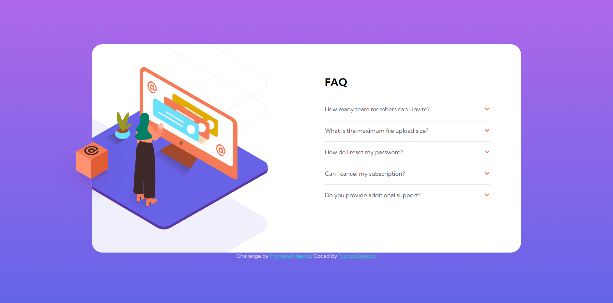

# Frontend Mentor - FAQ accordion card solution

This is a solution to the [FAQ accordion card challenge on Frontend Mentor](https://www.frontendmentor.io/challenges/faq-accordion-card-XlyjD0Oam). Frontend Mentor challenges help you improve your coding skills by building realistic projects. 

## Table of contents

- [Overview](#overview)
  - [The challenge](#the-challenge)
  - [Screenshot](#screenshot)
  - [Links](#links)
- [My process](#my-process)
  - [Built with](#built-with)
  - [Useful resources](#useful-resources)
- [Author](#author)
- [Acknowledgments](#acknowledgments)

## Overview

### The challenge

Users should be able to:

- View the optimal layout for the component depending on their device's screen size
- See hover states for all interactive elements on the page
- Hide/Show the answer to a question when the question is clicked

### Screenshot

### Links

- Solution URL: [Add solution URL here](https://www.frontendmentor.io/solutions/faq-accordion-card-GoBErB69I1)
- Live Site URL: [Add live site URL here](https://sir-floppa.github.io/Frontend-Mentor-03-FAQ-Accordion-Card/)

## My process

### Built with

- HTML
- CSS
- Flexbox

## Author

- Website - [Nicolás Donoso](https://sir-floppa.github.io)
- Frontend Mentor - [@Sir-Floppa](https://www.frontendmentor.io/profile/Sir-Floppa)
- Instagram - [@sir_floppa](https://www.instagram.com/sir_floppa/)
